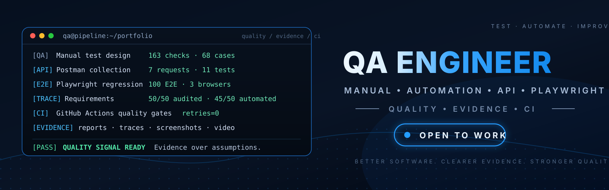

  

<h1 align="center">Tokhirjon Yuldoshev</h1>

  <strong>QA Engineer · Manual + Automation · API · Playwright · TypeScript</strong>

  <a href="https://drive.google.com/drive/folders/1jOgOuHUcla3uYUn19Nq9-hPdJ7Xr0nen">Portfolio</a> ·
  <a href="https://github.com/TokhirjonYuldoshev/pomidorqa-tests">PomidorQA</a> ·
  <a href="https://drive.google.com/file/d/1sFf6KpRQRxlrhqmqi_G3z0rfFplJzo3G/view">Resume RU</a> ·
  <a href="https://drive.google.com/file/d/1J40-R5QbODzNcwXBoEmEsB0l2Xt5BvsB/view">Resume EN</a> ·
  <a href="https://drive.google.com/drive/folders/1iMNJ7UCQ5xz69Uy0mDM2vGnYydHUeNhJ">Certificates</a> ·
  <a href="https://t.me/TokhirjonYuldoshev">Telegram</a> ·
  <a href="https://www.linkedin.com/in/tokhirjon-yuldoshev/">LinkedIn</a>

  
  
  
  

Тестирую веб-приложения и REST API вручную и автоматизирую ключевые сценарии так, чтобы результат можно было **доказать, воспроизвести и быстро диагностировать**.

Основной стек: **Playwright + TypeScript**, REST API, Postman, Chrome DevTools, SQL, Git и GitHub Actions.

**Санкт-Петербург · удалённый / гибридный / офисный формат**

---

## Избранные QA-проекты

### [PomidorQA — Automation QA](https://github.com/TokhirjonYuldoshev/pomidorqa-tests)

Основной automation-проект на **Playwright + TypeScript** с Unit, API и E2E-проверками, cross-browser regression и traceability от требований до тестов.

- **50 / 50 requirements** прошли аудит;
- **45 / 50 requirements automated = 90%**;
- **121 automated checks**: 10 Unit + 11 API + 100 E2E;
- **100 E2E** выполняются в Chromium, Firefox и WebKit;
- **retries=0**;
- Page Object Model, fixtures/helpers, API-based Arrange и cleanup;
- GitHub Actions quality gates, Allure, Playwright HTML, JSON/JUnit, traces, screenshots и video.

[Repository](https://github.com/TokhirjonYuldoshev/pomidorqa-tests) ·
[Coverage Matrix](https://github.com/TokhirjonYuldoshev/pomidorqa-tests/blob/main/docs/coverage-matrix.md) ·
[Test Strategy](https://github.com/TokhirjonYuldoshev/pomidorqa-tests/blob/main/docs/test-strategy.md) ·
[CI Runbook](https://github.com/TokhirjonYuldoshev/pomidorqa-tests/blob/main/docs/ci-incident-runbook.md)

**Stack:** Playwright · TypeScript · Node.js · GitHub Actions · Allure · axe-core · Lighthouse

---

### [Pizzaed — Manual QA + REST API](https://drive.google.com/drive/folders/1HWGeywjJ2qnSpFE4awpLrqIGwLfKhCHu)

Учебный интернет-магазин: каталог, фильтрация, корзина, промокоды, доставка и оформление заказа.

- подготовил **чек-лист из 163 проверок**;
- разработал **68 тест-кейсов**;
- составил test plan со scope, рисками, entry/exit criteria и окружением;
- собрал Postman collection: **7 API-запросов / 11 автоматических проверок**;
- Postman Runner: **11 / 11 passed**;
- использовал variables, JavaScript и dynamic ID chaining;
- оформил отдельные **Selected Bug Reports**.

[Test Plan](https://drive.google.com/file/d/15k9sKUtTIPpGfeWJInJ0y-y1pWpPAwGm/view) ·
[Checklist — 163](https://drive.google.com/file/d/19kPAyDkhjnGMDD6UsfZI0aGNmfVhI7D7/view) ·
[Test Cases — 68](https://drive.google.com/file/d/1bKqsyOt3x6yEm5yLOcKcuNFYnSf9TwP3/view) ·
[Postman Collection](https://drive.google.com/file/d/15s96s0tLzJSFMU4XNQOzy27rM-kNWRZp/view) ·
[Runner 11/11](https://drive.google.com/file/d/1GcxOnm7WePykHxIefxn2ibdl3iZPrGUX/view) ·
[Bug Reports](https://docs.google.com/document/d/1SW8HppEPKJh7--DG1pnzdFJosgVcwpBKWLIWk_IS4ns/edit)

**Stack:** Manual QA · REST API · Postman · Chrome DevTools · Test Design

---

## Инженерные практики

- **Requirements → Test Cases → Evidence:** связываю требования с конкретными проверками и результатами.
- **Test design:** позитивные/негативные сценарии, boundary values, equivalence classes, error guessing.
- **Automation architecture:** Page Object Model, fixtures, helpers, уникальные данные и изолированные BrowserContext.
- **API testing:** Arrange/cleanup через API, Postman variables, JavaScript и автоматические assertions.
- **CI & diagnostics:** GitHub Actions, Allure, Playwright HTML, JUnit/JSON, traces, screenshots и video.
- **Reliable signal:** retries=0; продуктовые дефекты отделяются от infrastructure/CI failures.

---

## Дополнительные инженерные проекты

<b>QA Docker Monitor — PostgreSQL health & contract monitoring</b>

Система мониторинга PostgreSQL, где health подтверждается реальной записью и точным read-back текущего запуска.

- synthetic PostgreSQL health check;
- Windows/Jenkins-compatible contract tests;
- GitHub Actions quality gate;
- Trivy и CycloneDX SBOM;
- Telegram observability.

[Repository](https://github.com/TokhirjonYuldoshev/qa-docker-monitor)

**Stack:** PostgreSQL · PowerShell · Docker · GitHub Actions · Jenkins

<b>Python + Docker — CI/CD quality pipeline</b>

Учебный CI/CD-проект с независимыми quality-сигналами.

- Pytest + JUnit evidence;
- Flake8 и dependency checks;
- Docker build + runtime smoke;
- non-root validation;
- Trivy и CycloneDX SBOM;
- Jenkins Declarative Pipeline.

[Repository](https://github.com/TokhirjonYuldoshev/my-docker-project)

**Stack:** Python · Pytest · Docker · GitHub Actions · Jenkins

---

## Технологии

| Направление | Инструменты |
| --- | --- |
| Manual QA | Test design, Checklists, Test Cases, Bug Reports |
| Automation | Playwright, TypeScript |
| API | REST API, Postman, JavaScript |
| Data | SQL, PostgreSQL, MySQL |
| QA / Debugging | Chrome DevTools, Charles Proxy |
| TMS / Bug Tracking | TestRail, TestIT, тестовые прогоны, жизненный цикл дефекта |
| CI / Reporting | GitHub Actions, Allure, Playwright HTML, JUnit, JSON |
| Version Control | Git, GitHub |
| Дополнительно | Docker, Jenkins, Pytest, Trivy, CycloneDX |

<b>Образование</b>

- **Санкт-Петербургский государственный технологический институт (СПбГТИ)** — Бизнес-информатика, 2024–н.в.
- **Южно-Казахстанская государственная медицинская академия (ЮКГМА)** — Фармация, провизор, 2006.

---

## Контакты

- **Email:** [toxir.yuldoshev1983@gmail.com](mailto:toxir.yuldoshev1983@gmail.com)
- **Telegram:** [@TokhirjonYuldoshev](https://t.me/TokhirjonYuldoshev)
- **LinkedIn:** [tokhirjon-yuldoshev](https://www.linkedin.com/in/tokhirjon-yuldoshev/)

---

## QA Portfolio

📁 **[QA Portfolio — Tokhirjon Yuldoshev](https://drive.google.com/drive/folders/1jOgOuHUcla3uYUn19Nq9-hPdJ7Xr0nen)**

### Resume
- [Tokhirjon_Yuldoshev_QA_Resume_RU.pdf](https://drive.google.com/file/d/1sFf6KpRQRxlrhqmqi_G3z0rfFplJzo3G/view)
- [Tokhirjon_Yuldoshev_QA_Resume_EN.pdf](https://drive.google.com/file/d/1J40-R5QbODzNcwXBoEmEsB0l2Xt5BvsB/view)

### Pizzaed
- [Test_Plan_Pizzaed.docx](https://drive.google.com/file/d/15k9sKUtTIPpGfeWJInJ0y-y1pWpPAwGm/view)
- [Checklist_Pizzaed_163_checks.docx](https://drive.google.com/file/d/19kPAyDkhjnGMDD6UsfZI0aGNmfVhI7D7/view)
- [Test_Cases_Pizzaed_68_cases.docx](https://drive.google.com/file/d/1bKqsyOt3x6yEm5yLOcKcuNFYnSf9TwP3/view)
- [Pizzaed_API_Postman_7_requests_11_tests.json](https://drive.google.com/file/d/15s96s0tLzJSFMU4XNQOzy27rM-kNWRZp/view)
- [Postman_Runner_11_of_11.png](https://drive.google.com/file/d/1GcxOnm7WePykHxIefxn2ibdl3iZPrGUX/view)
- [Pizzaed — Selected Bug Reports](https://docs.google.com/document/d/1SW8HppEPKJh7--DG1pnzdFJosgVcwpBKWLIWk_IS4ns/edit)

### PomidorQA
- [pomidorqa-tests](https://github.com/TokhirjonYuldoshev/pomidorqa-tests)
- [Automation QA Overview](https://docs.google.com/document/d/1F5aDy-gw0pHkVuSmt2PHZuCsvTmBjffh3i5T_u64C7A/edit)
- [coverage-matrix.md](https://github.com/TokhirjonYuldoshev/pomidorqa-tests/blob/main/docs/coverage-matrix.md)

### Certificates
- [AIQA — AQA за 60 дней · Playwright + TypeScript](https://drive.google.com/file/d/1vYN2JsDQ2uVomErAMfkKNmPhcHNkUc7k/view) · [Verify](https://aiqa.su/certificate/AIQA-AQA-2026-0006)
- [AIQA — В QA за 60 дней](https://drive.google.com/file/d/1k7pf6YRm2xDV3A9cjuxK1Lmql9hrpjcp/view) · [Verify](https://aiqa.su/certificate/AIQA-2026-000001)
- [Stepik — Software Testing PRO · 100%](https://drive.google.com/file/d/1eISI5UGttfVzaW4rmZhJghMgKawZqE_4/view)
- [Stepik — SQL SELECT · 100%](https://drive.google.com/file/d/1VVywvrLB1yxrdORBGMO2EMBAa6ieYo7d/view)
- [Stepik — QA Practical Trainers · с отличием](https://drive.google.com/file/d/1_ReHVhqniAbOmV28HV59De6OBSxryuBJ/view)
- [All certificates](https://drive.google.com/drive/folders/1iMNJ7UCQ5xz69Uy0mDM2vGnYydHUeNhJ)
